# DM-Companion
DM-Companion is a real-time initiative tracker for Dungeons and Dragons 5th edition with Phillips hue light integration for generating ambience. The app uses SocketIO for transmitting data between dungeon masters (DM) and their players so that they can more easily track the initiative order, view relevant stat data, and speed up combat interactions. We feel this app has both merit for in-person games as well as games taking place remotely through skype or other software. While there are other apps on the market that cater to DMs we didn't see any that used socketIO for real-time data transmission and updating without refreshing as well as none that integrated the phillips hue lights.

## Getting Started

Navigate your favorite browser to [DM-Companion](https://dm-companion.herokuapp.com/). Our app is mobile-responsive and works great on phones, tables, laptops, and desktops. If this is your first time visiting you should see the login screen.

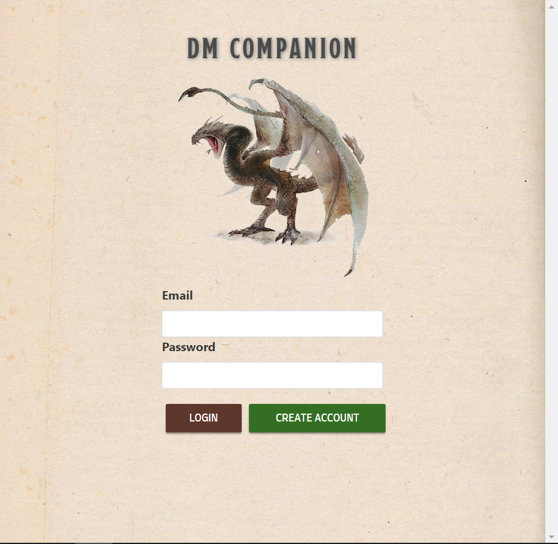

If you are new then click the create account name where you will be prompted to put in your e-mail and a password. There will also be a single checkbox question asking if this will be a DM account or a player account. DM accounts have the ability to create games and also many features unavailable to players such as controlling the hue lights, adding monsters to an encounter, and allow the DM to see more information during a fight than players. 

At this time if you are a DM for a game and a player in another game you will need separate accounts because of the difference in information that should be available to players, i.e. Monster's AC, Health, etc. which is not meant to be common knowledge for players. 

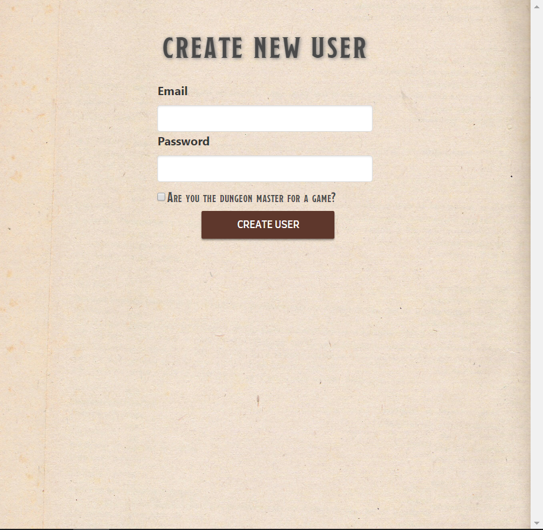

If you have already created an account and logged in previously your browser should remember this and when you navigate to the home page you will be redirected to the game select page.

### Login Issues or Password Resets

 If you are unsure if you already have an account you can attempt account creation and if the e-mail is already present in our database the option to reset your password will be available. Also if you attempt to login on the main-page and can't remember your password a similar prompt will appear.

 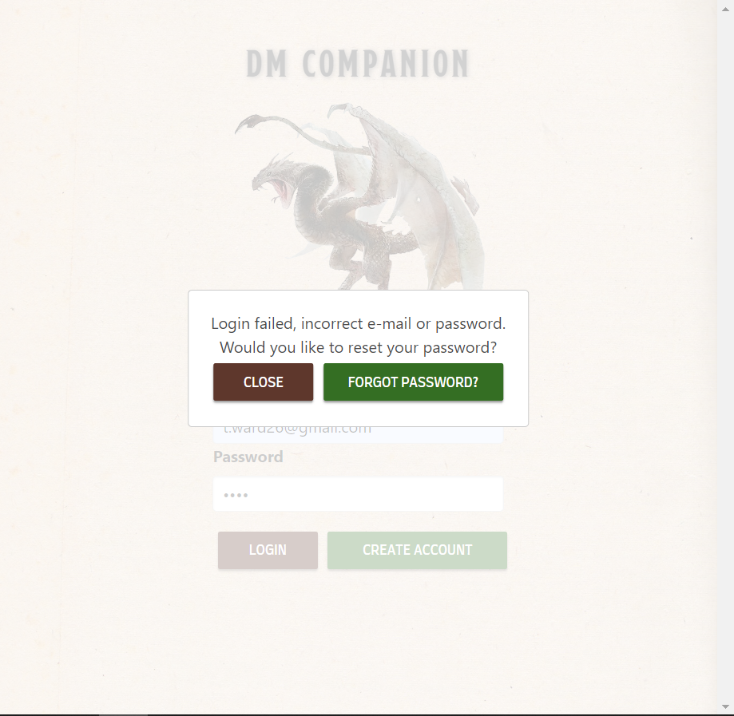

 If you do need to reset your password you can visit our forgot password page which will prompt you for your e-mail.
 
  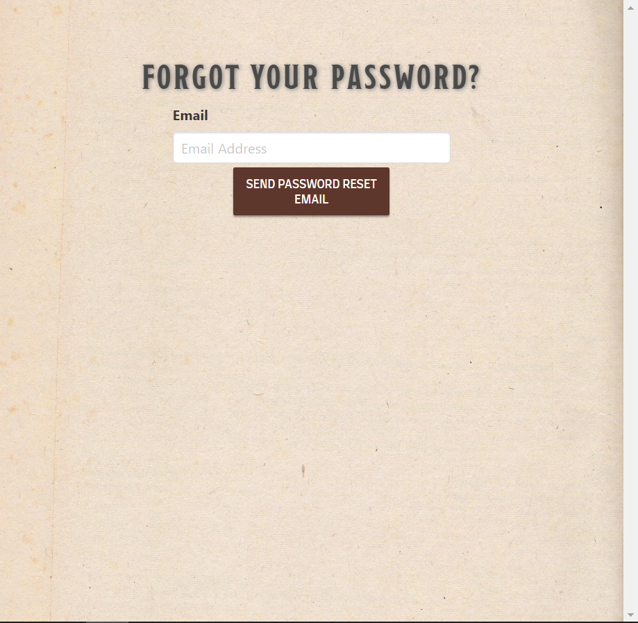
 
  If your e-mail is found in our database you will be sent an e-mail containing a link to reset your password in our database. This link expires after 1 hour so if you wait to long to reset your password you will have to send another password reset e-mail. All passwords are encrypted in our database.

   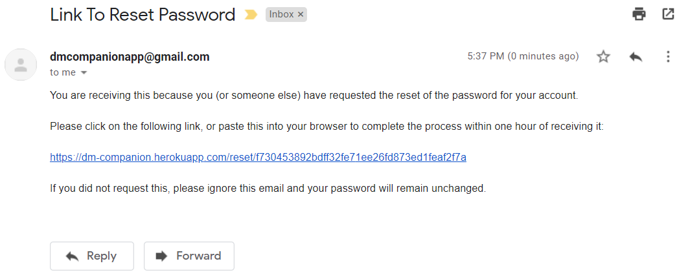

If you click the link and it is within an hour of sending the e-mail you will have the option to put in a new password

 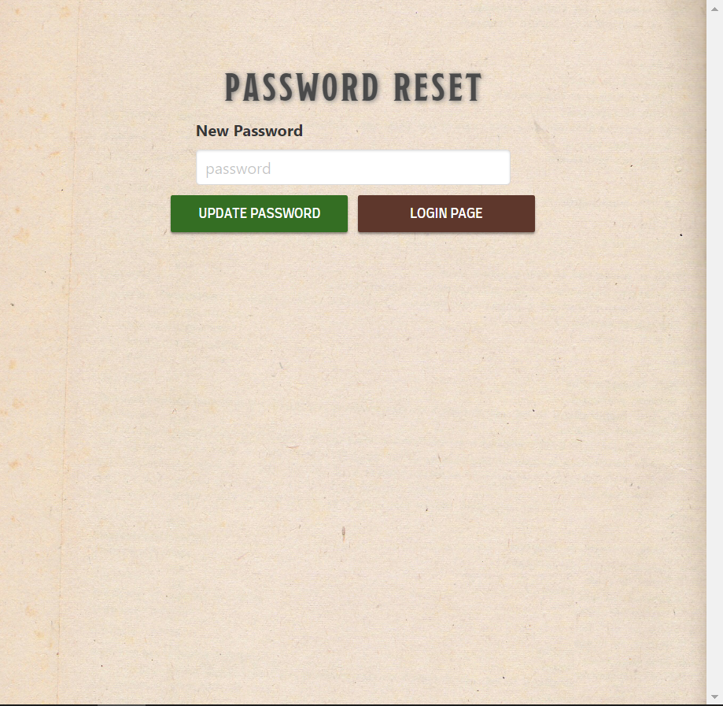

 ## Game Select

 Upon successful login you will be taken to the game select screen, if you aren't currently associated with any games your screen should look like this 

  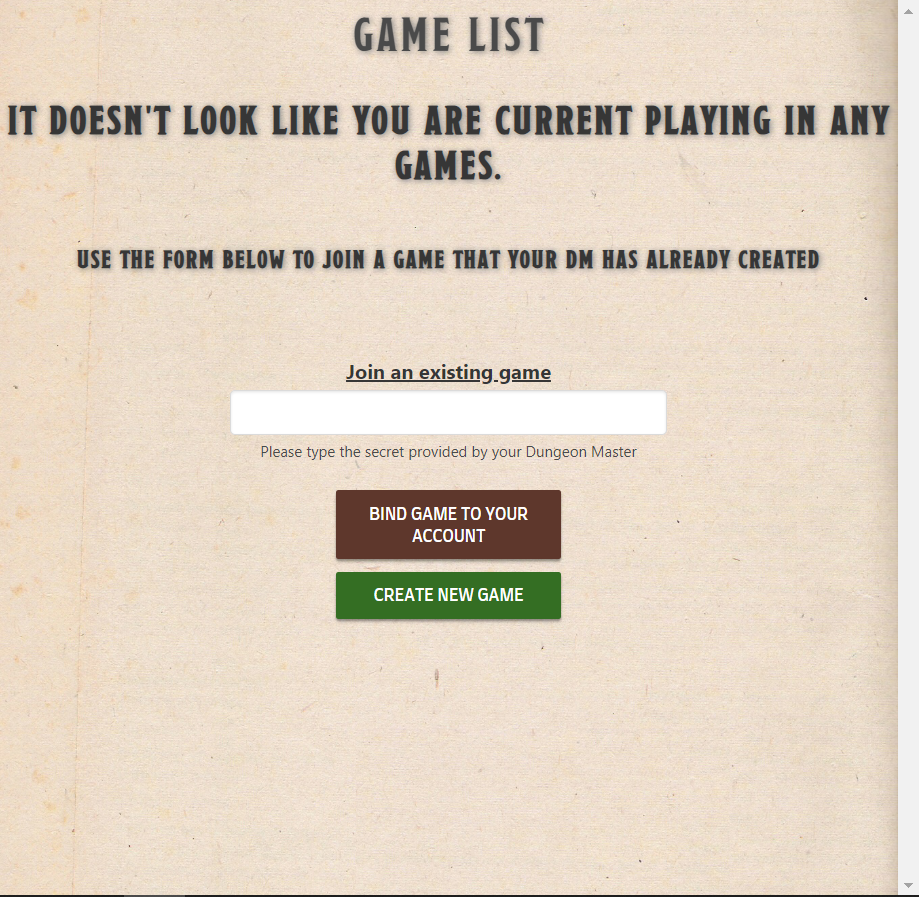

  If you are a DM you will see the create game button, if you are a player this button will no be present.

  ### Creating a game

  DM's have the ability to create games, and you can DM multiple games as well, each of the games you DM will shown on your list. To create a game click the create game button which will take you to the create game screen.

 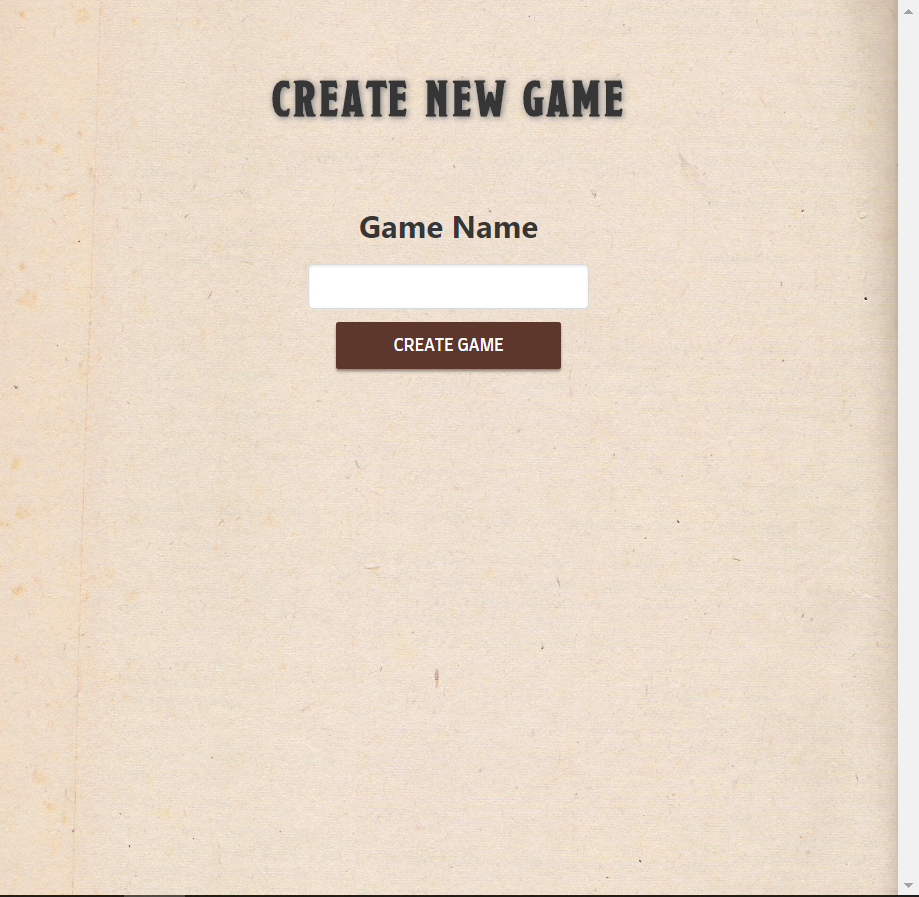

 From here you just type in what you would like your game to be called and it will be created with a randomly generated secret that you can give to your players. This secret allows them to join your specific game.

 ### Joining a game

 If you are a player to join a game that your DM has already created you will need to put in the secret associated with your game, this will be delayed on the DM's game select screen as well as in the game itself for the DM. Putting in the game's secret associates the game with your account and you will only have to do this the first time you join a game. Upon subsequent login's all games associated with your account will be displayed on the game select screen. If you are finished with a game or leave a game you can click the button to remove the game from being associated with your account.

  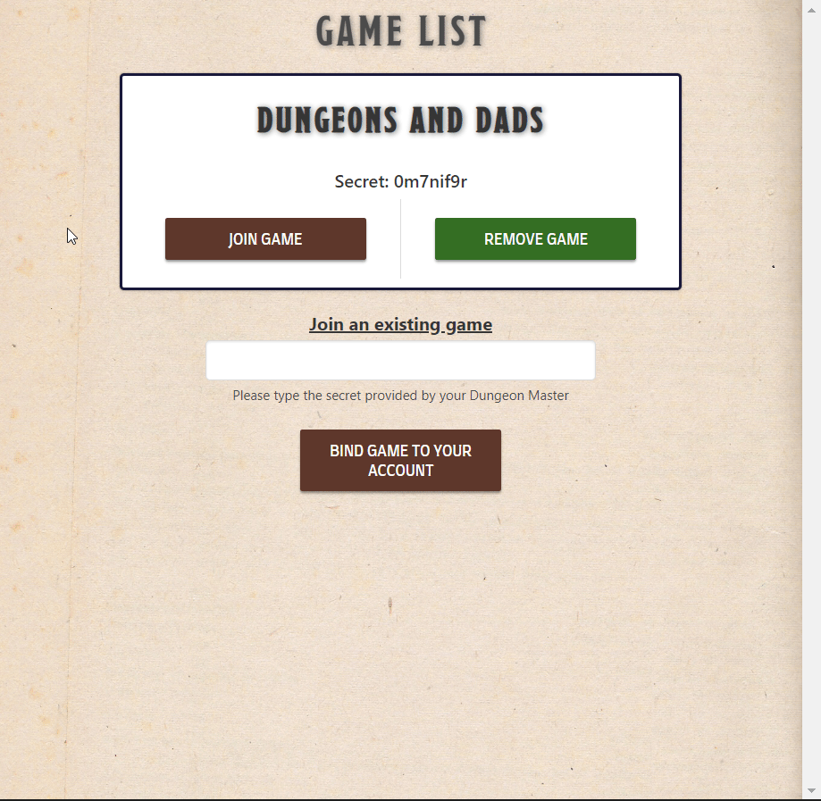

  DM's also have the abilty to delete games but this should only be used when a game is finished as this will delete the game from our database and your players will no longer be able to join the game either.

  ## Initiative Tracker

  This is the meat and potatoes our app and you will see two different views depending on if you are a player or dungeon master.

  ### Player View

  Upon joining the game you should create a character by clicking the button at the bottom of the page, this will let you create your character for use in the app. You will be presented with a form to fill out with all of your basic stat information as well as selecting an avatar for your character. We will continue to add more avatars as development continues so if you don't see one that represents your character well enough keep checking back.

   

   After you have created your character you will be taken back to the game screen and a card for your character as well as any other characters or monsters currently in the encounter will be displayed.

   All of the fields on your card, including your name, can be edited by clicking the small icon next to the number for the stat. This is especially important for health and initiative.

   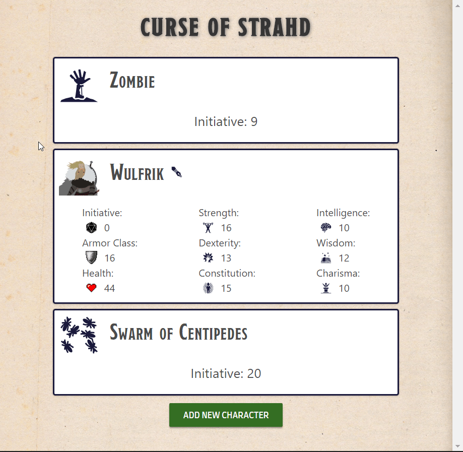

   These changes will be immediately reflected in our database immediately and will persist upon page refresh. Any value changes will also be immediately transmitted and updated for all other players in your group as well as the DM. This real-time updating allows you to see things change without refreshing the page.

   #### Combat!

   When you get into a combat encounter, roll your initiative (either rolling physical dice or by any other means) and put in your inititiative, when all players initiative has been put in the DM will then sort the list of all players and monsters by initiative and you are ready for the first round of combat!

   When your character is at the of the list it is officially your turn, do what you need to do and when you are done with your turn click the turn done button and you will be bumped to the bottom of the list and it will be the next person in the initiative orders turn.

   Players will be able to see all stat information for themselves and other player characters but will be restricted in only seeing the names and initiative values of monsters or NPCs (non-player characters). The DM can see the information for these though and will be keeping track of their stats for you as well as ending their turn when they are done with their actions.

   ### Dungeon Master View

   The DM's initiative screen is similar to the player's view but has some other added features. Firstly you will notice at the top you have several tabs, the main tab you will be taken to is the initiative tab that is shared with the players, you also will have a tab for controlling your phillips hue lights (if you own any), you do not need to own any phillips hue lights to use our app but if you do have them you will get the added benefit of being able to generate some atmosphere for your players with various lighting effects! There is also a tab at the top for logging out on this page.

   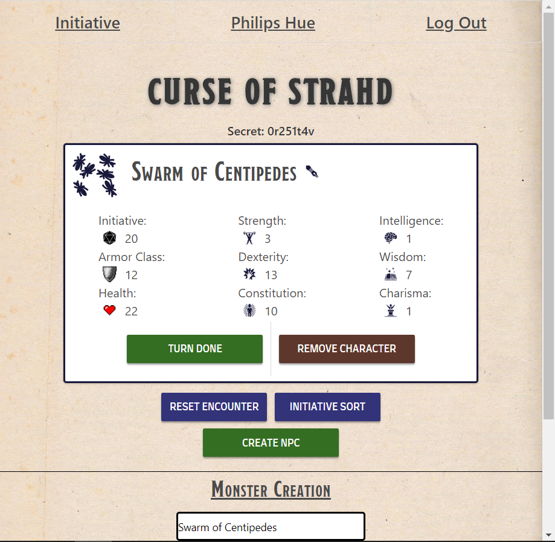

   The main features you have that differs from that of the players is the ability to add NPC's and Monsters to an encounter as well as controlling the initiative order by sorting or resetting initiative after the encounter is done.
   
Creating an NPC works the same as creating a character so please see the section above about creating a character. The only difference between NPCs and characters is that NPCs can be deleted before they have their health stat set to 0 and their stat information isn't available for players, only the DM can see their stats. This holds true for any monsters your create as well.

Adding a Monster to an encounter can be done using the Monster Creation bar at the bottom, our database contains approximately 325 different pre-generated monsters that you can drop in to your encounter with all of their stat information already filled out. When you add a monster it will also already have it's initiative randomly generated for it as well! Once you have added a monster you can freely rename it as well such as if you have a specific enemy your players are fighting, i.e. renaming a vampire to Count Strahd. Monsters will have a different icon depending upon what type of monster category they fall into.

   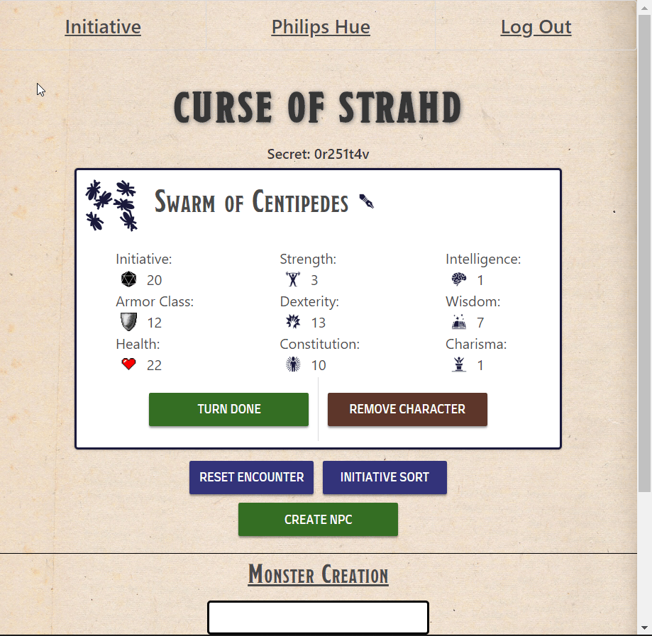

Once all players and monsters have been added to a combat just click the initiative sort button and the list of players, npcs, and monsters will be sorted based on initiative order. Turn order then proceeds from the top of the list with either the player or the DM clicking turn done whenever the current top of the list's NPC/Monster/Character is finished with their turn.

Whenever combat is finished just clicked the reset encounter button which will reset all players initiative back to 0 and then keep playing as normal until you get into combat again and have your players roll their initiative again and set it in the app.

   

   #### Phillips Hue Lights

Click on the tab for Phillips Hue if you own any phillips hue bulbs and their associated bridge. This will give you the ability to generate some ambience and lighting effects for your players. You will see a button that allows our app to communicate with your bridge.

   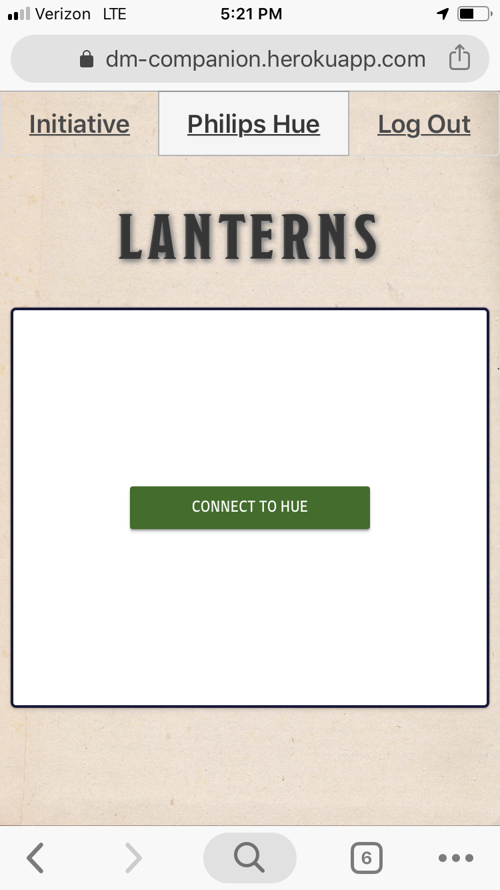

The link will take you to the hue login page where you can grant our app permission to access your bridge to trigger lighting effects based on buttons you click.

   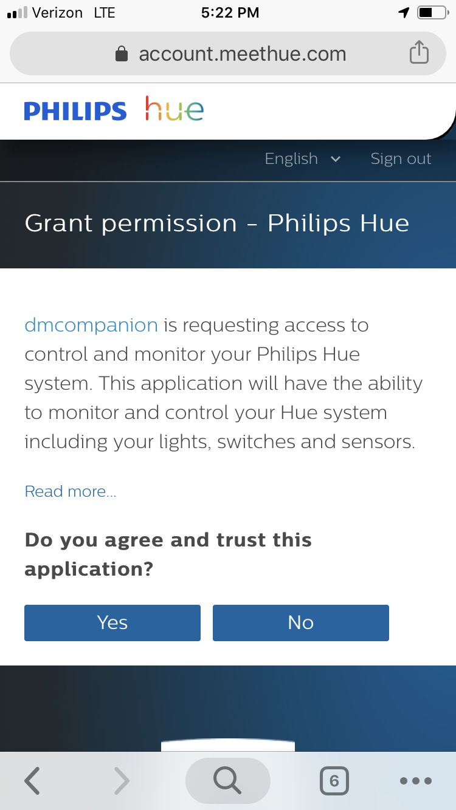

Upon approval you will be redirected back to the hue page where if you bridge is properly detected you will see a dropdown to select which lights you want to use to trigger the various lighting effects.

   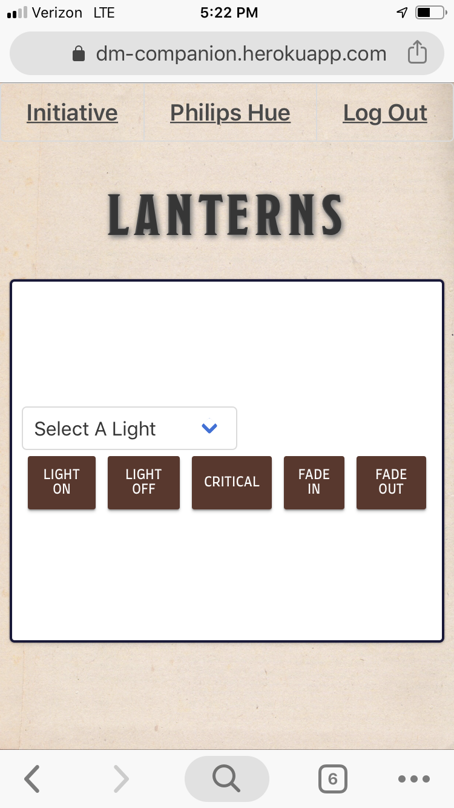

   These lighting effects include simple things like turning the light on or off to more elaborate features like fading the light in or out like the sun rising in the morning or setting at night. We also have a special effect for critical rolls so whenver your players roll a critical make sure to click this for extra fun! We plan on adding more lighting effects in the near future like lightning flashes for storms, colored lighting effects like lava, candles flickering, green swampy glows, etc. Keep checking back to see what else gets added in!

## Built With

* React
* SocketIO
* Phillips Hue remote API
* Passport for user authentication and bcrypt for password hashing
* Dungeons and Dragons 5e API for monster data

## Contributing

If you would like to join our team and contribute to our app please let us know, we can be reached at dmcompanionapp@gmail.com. Please submit any bugs or issues through our github page as well 

   [DM-Companion Github](https://github.com/Jonorlowski1/Project-3-DM-App)

## Authors

* Justin Klaas
* Jonathan Orlowski
* Tyler Ward

## License

This project is licensed under the MIT License

## Acknowledgments

Thank you Byron Ferguson, Shaun Befort, and Tim Lukens for teaching us how to code throughout the KU coding bootcamp and helping along the way!